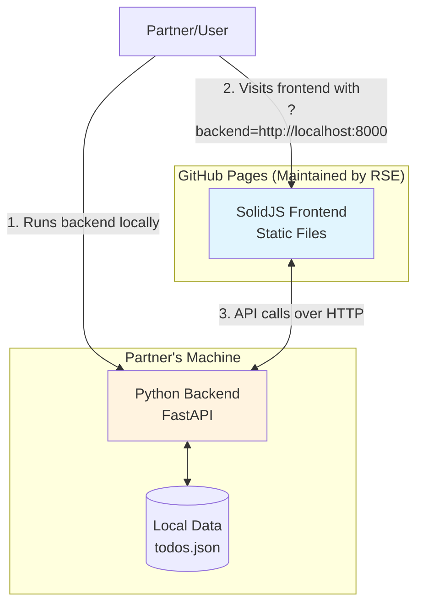
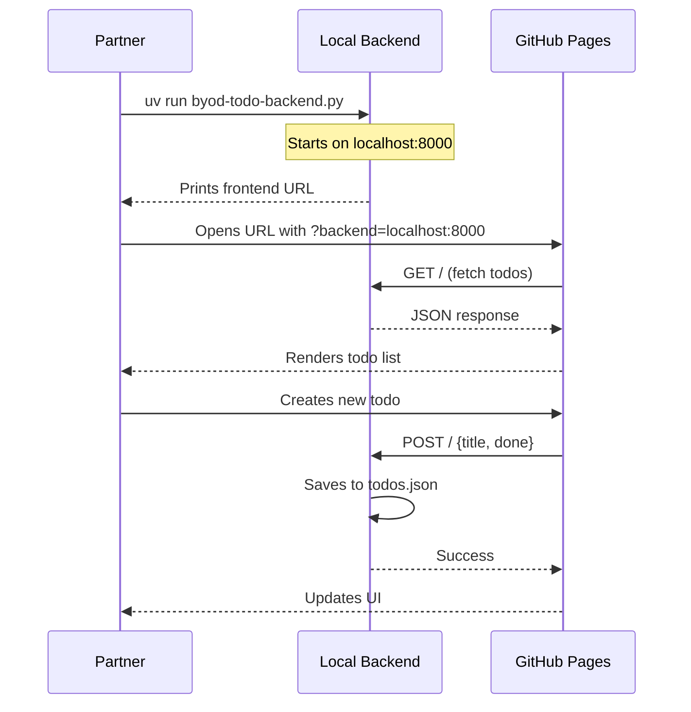

# Bring Your Own Backend

*A pattern for sustainable research software collaboration*

As a research software engineer (RSE) at a university, I've spent the last two years working on a collaborative project with domain scientists. The division of labor was clear from the start: my partners would focus on the computational backend — processing data, running simulations, and implementing domain-specific algorithms — while I would build the web-based interface that makes their work accessible and interactive.

It was a productive arrangement. They knew Python and their scientific domain inside out. I knew JavaScript frameworks, modern web tooling, and how to build responsive single-page applications. Together, we built something useful.

But as the project neared its end, a familiar worry crept in: *what happens after I leave?*

## The Sustainability Problem

My partners are brilliant scientists, but they're not frontend developers. The JavaScript ecosystem moves fast — build tools, frameworks, deployment pipelines — and expecting them to maintain a complex web application alongside their research was unrealistic. Yet their backend code? That they could handle. Python scripts, data processing, API endpoints — this was their territory.

The traditional approach would have been to build a monolithic application where frontend and backend are tightly coupled, deployed together, and maintained as one unit. But that would mean my partners would need to understand both sides to make any changes. A recipe for software rot.

I needed a different approach. One where the frontend could essentially "freeze" after I left, while my partners could continue evolving their backend independently.

## The Solution: Bring Your Own Backend

The key insight was simple: **decouple where the frontend is hosted from where the backend runs**.

Instead of deploying the frontend and backend together on some server that my partners would need to maintain, I separated them completely:

- **Frontend**: Hosted as static files on GitHub Pages — zero maintenance, free hosting, always available
- **Backend**: Runs on my partners' own machines, under their full control

The magic that connects them? A URL query parameter.



## The Magic: URL-Based Backend Configuration

Here's the core pattern. The frontend reads the backend URL from the query string:

```tsx
const App: Component = () => {
  const backend = new URLSearchParams(location.search).get('backend');
  return (
    <Show when={backend !== null} fallback={<BackendForm />}>
      <TodoApp backend={backend!} />
    </Show>
  );
};
```

When someone visits the frontend without specifying a backend, they see a helpful form with instructions:

```tsx
const BackendForm: Component = () => {
  return (
    <div>
      <h2>Please specify backend URL</h2>
      <form method="get">
        <label for="backend">Backend URL:</label>
        <input
          type="text"
          id="backend"
          name="backend"
          value="http://localhost:8000"
          required
        />
        <input type="submit" value="Submit" />
      </form>
      <p>Backend instructions</p>
      <ol>
        <li>Make sure you have <a href="https://docs.astral.sh/uv/">uv</a> installed</li>
        <li>Start the backend with: <code>uv run byod-todo-backend.py</code></li>
      </ol>
    </div>
  );
};
```

The workflow becomes beautifully simple:

1. Partner starts their backend locally
2. Partner visits the frontend URL with `?backend=http://localhost:8000`
3. The frontend connects to their local backend
4. All data stays on their machine

No rebuilds. No redeployments. No complex configuration. Just a URL parameter.

## Keeping It Simple for Partners

For this pattern to work after I leave, the backend needs to be dead simple to run. I achieved this using Python with [inline script metadata (PEP 723)](https://peps.python.org/pep-0723/) and [uv](https://docs.astral.sh/uv/):

```python
#!/usr/bin/env -S uv run
# /// script
# requires-python = ">=3.12"
# dependencies = [
#   "fastapi", "uvicorn"
# ]
# ///

from dataclasses import dataclass
from fastapi import FastAPI
from fastapi.middleware.cors import CORSMiddleware

@dataclass
class Todo:
    title: str
    done: bool = False

app = FastAPI()
app.add_middleware(
    CORSMiddleware,
    allow_origins=["*"],
    allow_methods=["*"],
)

@app.get("/")
def get_todos(done: bool | None = None) -> list[Todo]:
    # ... implementation
```

The entire backend is a single Python file. No `requirements.txt`, no virtual environment setup, no Docker. Partners just run:

```bash
uv run byod-todo-backend.py
```

And to make it even more user-friendly, the backend prints a clickable link to the frontend on startup:

```python
def main() -> None:
    url = "https://sverhoeven.github.io/byob-todo-frontend/?backend=http://localhost:8000"
    print(f"Starting TODO backend service ...")
    print(f"Open TODO frontend at: {url}")
    print("(Press CTRL+C to quit)")
    uvicorn.run(app, host="0.0.0.0", port=8000)
```

## The Contract: OpenAPI as the Bridge

The frontend and backend need to agree on an API contract. Rather than maintaining documentation that inevitably drifts from reality, I used OpenAPI as the single source of truth.

FastAPI automatically generates an OpenAPI specification from the Python code. I then use `openapi-typescript` to generate TypeScript types:

```bash
openapi-typescript http://localhost:8000/openapi.json -o src/api.d.ts
```

This generates type definitions like:

```typescript
export interface paths {
    "/": {
        get: operations["get_todos__get"];
        post: operations["create_todo__post"];
    };
    "/{title}": {
        put: operations["set_done__title__put"];
        delete: operations["delete_todo__title__delete"];
    };
}

export interface components {
    schemas: {
        Todo: {
            title: string;
            done: boolean;
        };
    };
}
```

The frontend then uses `openapi-fetch` to make type-safe API calls:

```tsx
import createClient from 'openapi-fetch';
import type { paths } from './api';

const TodoApp: Component<{ backend: string }> = (props) => {
  const client = createClient<paths>({ baseUrl: props.backend });
  
  // Type-safe API calls - TypeScript catches errors at compile time
  const { data, error } = await client.GET('/', {
    params: { query: { done: true } }
  });
};
```

This gives us compile-time safety: if my partners change the API contract, the TypeScript compiler will catch any mismatches when regenerating the types.



## After the Project: What Worked

Two years later, the project has officially ended. I've moved on to other work, but the software lives on. Here's what the BYOB pattern enabled:

**For my partners:**
- They continue using and modifying their Python backend
- They don't need to touch JavaScript, npm, or deployment pipelines
- Their data stays on their machines — important for sensitive research data
- They can share the tool with colleagues who just need to run one command

**For the frontend:**
- It's frozen in time on GitHub Pages, requiring zero maintenance
- It works with any backend that implements the same API contract
- No servers to keep running, no SSL certificates to renew

**For sustainability:**
- Clear separation of concerns means clear ownership
- The API contract serves as documentation
- New team members can understand the boundary immediately

## When to Use BYOB

This pattern isn't for every project, but it shines when:

- **Different expertise levels**: Frontend specialists work with domain experts who prefer other languages
- **Data sensitivity**: Partners need to keep data on their own machines
- **Limited resources**: No budget for ongoing server maintenance
- **Collaborative research**: Multiple groups might want to run their own backends

The "Bring Your Own Backend" pattern turned what could have been abandoned software into a sustainable tool that my partners can use and evolve long after our collaboration ended. Sometimes the best code you write is the code others don't have to maintain.

---

*The example code for this pattern is available at [byob-todo-frontend](https://github.com/sverhoeven/byob-todo-frontend) and [byob-todo-backend](https://github.com/sverhoeven/byob-todo-backend).*
