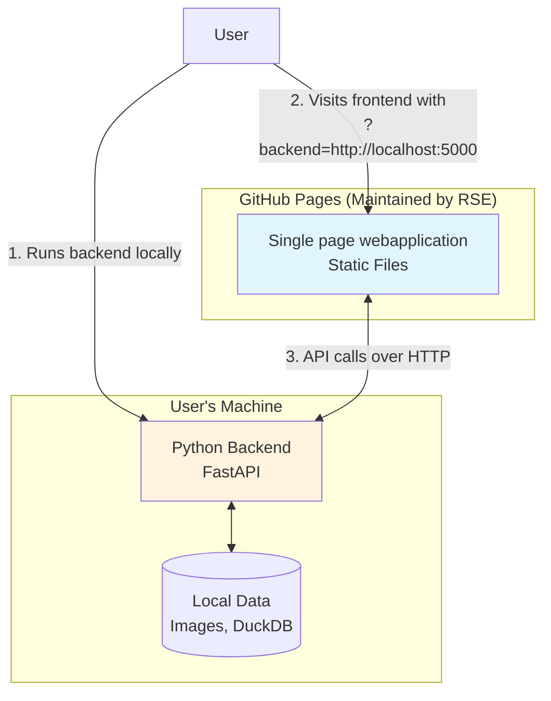
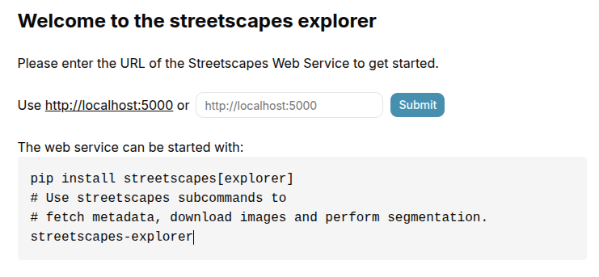
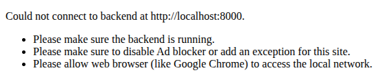

# Bring Your Own Backend

*A pattern for sustainable research software collaboration*

As a research software engineer (RSE) working at the Netherlands eScience Center, I work on a projects together with domain scientists at universities and research institutes. 

For example currently I am working on the [Urban-M4 project](https://research-software-directory.org/projects/urban-m4) where we are trying to improve a weather model by telling it the properties of buildings in a city. As part of this project, I built a web-based application called [streetscapes-explorer](https://github.com/Urban-M4/Urban-M5) to create, review and edit segmented street view images. My engineering colleagues and project partners worked on the machine learning models and data processing pipelines that powered the backend of the web application.

But as the project neared its end, a familiar worry crept in: *what happens after I leave?*

## The sustainability problem

The project partners are domain scientists first and foremost. They have the expertise and time to maintain a Python backend—updating dependencies, fixing bugs, evolving their data processing pipelines. But maintaining a highly interactive frontend written in TypeScript, with its constantly shifting JavaScript ecosystem, build tools, and UI frameworks, is a different story. That's not where their expertise or time should go.

A traditional monolithic application—with frontend and backend tightly coupled and deployed together—would force them to maintain both. They'd need to keep the server running, dependencies updated, security patches applied, and yes, understand that frontend code when something inevitably breaks. Given their constraints, this is a recipe for software rot and eventual abandonment.

I needed a different approach. One where the frontend could essentially "freeze" after I left, requiring zero maintenance, while my partners could continue evolving their backend independently.

## The solution: Bring Your Own Backend

The key insight was simple: **decouple where the frontend is hosted from where the backend runs**.

Instead of deploying the frontend and backend together on some server that my partners would need to maintain, I separated them completely:

- **Frontend**: As a single page web application using [React framework](https://react.dev/). Hosted as static files on [GitHub Pages](https://pages.github.com/) — zero maintenance, free hosting, always available
- **Backend**: Runs on my Users or partners' own machines, under their full control

The magic that connects them? A URL query parameter.



## The Magic: URL-based backend configuration

Here's the core pattern. The frontend reads the backend URL from the query string:

```tsx
export function App() {
  const backend = new URLSearchParams(location.search).get('backend');
  if (!backend) {
    return <BackendForm />;
  }
  return <StreetscapesExplorer backend={backend} />;
}
```

When someone visits the frontend without specifying a backend, they see a helpful form with instructions:




When the frontend is unable to connect to the specified backend, it shows an error message with troubleshooting tips:

[](streetscapes-explorer-backend-error.png)

The workflow becomes simply:

1. A user starts their backend locally
2. A user visits the frontend URL with `?backend=http://localhost:5000`
3. The frontend connects to their local backend
4. All data stays on their machine

No rebuilds. No redeployments. No complex configuration. Just a URL parameter.

## Keeping it simple for project partners

For this pattern to work after I leave, the backend needs to be dead simple to run. 

For the backend I used [FastAPI](https://fastapi.tiangolo.com/) because it makes building APIs in Python straightforward and enjoyable.

```python
from dataclasses import dataclass, field
from fastapi import FastAPI
from fastapi.middleware.cors import CORSMiddleware

app = FastAPI()
```

Web browsers do not like the frontend and backend to be at different URLs.
For this in the backend we need to enable [CORS](https://developer.mozilla.org/en-US/docs/Web/HTTP/CORS) like so:

```python
app.add_middleware(
    CORSMiddleware,
    allow_origins=["*"],
    allow_methods=["*"],
)
```

Then anyone can simply write a decorated and type annotated Python function to define an API endpoint:

```python
@dataclass
class FilterParams(Bbox):
    ratings: list[int] = Field(default=[])

@dataclass
class Image:
    id: str
    url: str
    lat: float
    lon: float

@app.get("/images")
async def fetch_images(filter: Annotated[FilterParams, Query()]) -> list[Image]
    # ... implementation
```


And to make it even more user-friendly, the backend prints a clickable link to the frontend on startup:

```python
def main() -> None:
    url = "https://urban-m4.github.io/Urban-M5/?backend=http://localhost:8000"
    print(f"Waiting for the streetscapes-explorer to start...")
    print(f"Goto {url}")
    print("(Press CTRL+C to quit)")
    uvicorn.run(app, host="0.0.0.0", port=8000)

if __name__ == "__main__":
    main()
```

If you're feeling more helpful you can use [webbrowser.open(url)](https://docs.python.org/3/library/webbrowser.html#webbrowser.open) to open the URL automatically in the user's default browser.

## The contract: OpenAPI as the bridge

The frontend and backend need to agree on an API contract. Rather than maintaining documentation that inevitably drifts from reality, I used [OpenAPI](https://www.openapis.org/) as the single source of truth.

FastAPI automatically generates an OpenAPI specification from the Python code. I then use [OpenAPI TypeScript](https://openapi-ts.dev/introduction) to generate TypeScript types:

```bash
openapi-typescript http://localhost:5000/openapi.json -o ./src/lib/streetscapes-api.ts
```

The frontend then makes type-safe API calls:

```tsx
import createClient from 'openapi-fetch';
import type { paths } from './lib/streetscapes-api';

function StreetscapesExplorer({backend}: { backend: string }) {
  const client = createClient<paths>({ baseUrl: backend }); 
  const { data = [], error } = await client.GET('/images', {
    params: { query: { rating: [4, 5] } }
  });
  return (
    <div>
      {error && <div>Error: {error.message}</div>}
      {data.map(image => (
        
      ))}
      {/* ... rest of the app like map view */}
    </div>
  );
};
```

This gives us compile-time safety: if my partners change the API contract, the TypeScript compiler will catch any mismatches when regenerating the types.

## Try it out yourself

I made a minimal example of this pattern with a [simple TODO application](https://sverhoeven.github.io/byob-todo-frontend/).
To use follow the instructions to run the backend locally.

The source code is available at [byob-todo-frontend](https://github.com/sverhoeven/byob-todo-frontend) and [byob-todo-backend](https://github.com/sverhoeven/byob-todo-backend). In the frontend I used SolidJS and bun to keep the frontend light.
In the backend I used uv and inline dependencies to keep the backend easy to run.

## When to use BYOB

This pattern isn't for every project, but it shines when:

- **Different expertise levels**: Frontend specialists work with domain experts who prefer other languages
- **Data sensitivity**: Users need to keep data on their own machines
- **Limited resources**: No budget for ongoing server maintenance
- **Collaborative research**: Multiple groups might want to run their own backends

The "Bring Your Own Backend" pattern turned what could have been abandoned software into a sustainable tool that my partners can use and evolve long after our collaboration ended. Sometimes the best code you write is the code others don't have to maintain.
